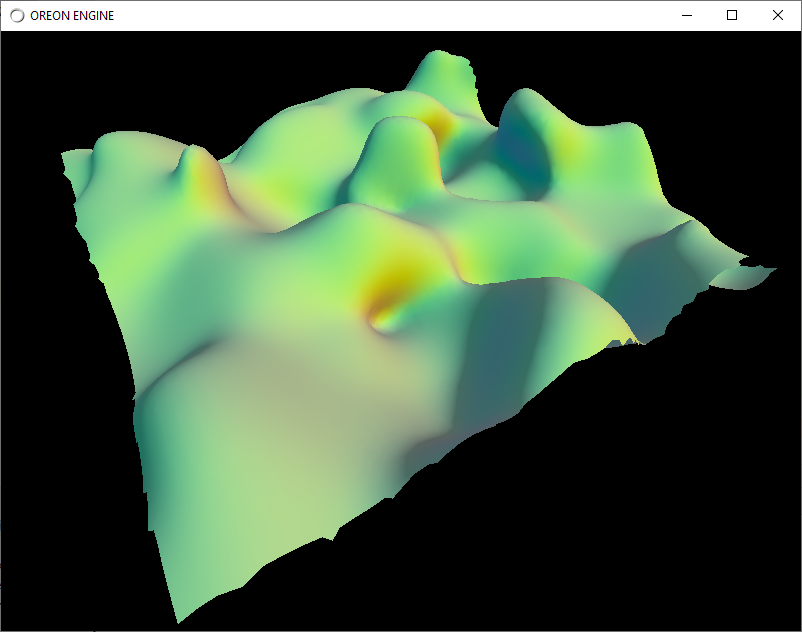
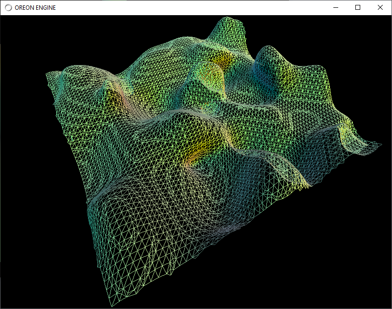

# Manifold dual contouring Java LWJGL

Java version of Manifold Dual contouring author John Lin20 https://github.com/Lin20/isosurface

## Build Instructions
The dependencies are:
  * Maven
  * Java 11
  * I used IntelliJ IDEA Community edition

 
 

W/S/A/D - forward, backward, left, right

F1 - solid / wireframe

F2 - Show chunks octree bounds

middle mouse - camera walking

Use:

Oreon Engine (Java - OpenGL/Vulkan) https://github.com/fynnfluegge/oreon-engine

 

Article:
https://people.engr.tamu.edu/schaefer/research/dualsimp_tvcg.pdf